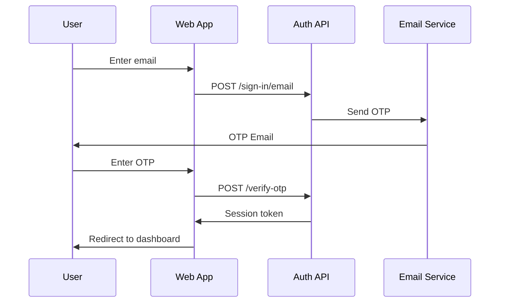

# API Documentation

This document describes the available API endpoints and tRPC procedures.

## Overview

The API is built with:
- **tRPC** for type-safe RPC procedures
- **Hono** as the HTTP server framework
- **Better Auth** for authentication endpoints

## Base URLs

| Environment | URL |
|-------------|-----|
| Development | `http://localhost:4000` |
| Production | Configure in environment |

## Authentication

### Better Auth Endpoints

All authentication is handled by Better Auth at `/api/auth/[...all]` on the web app.

| Endpoint | Method | Description |
|----------|--------|-------------|
| `/api/auth/sign-in/email` | POST | Sign in with email OTP |
| `/api/auth/sign-up/email` | POST | Sign up with email |
| `/api/auth/sign-out` | POST | Sign out current session |
| `/api/auth/session` | GET | Get current session |
| `/api/auth/verify-otp` | POST | Verify email OTP code |

### Authentication Flow



## tRPC Procedures

### Router Structure

```
appRouter
├── healthCheck    (public)
└── getUser        (public)
```

### Health Check

**Procedure**: `healthCheck`
**Type**: Query
**Auth**: Not required

Returns server health status.

```typescript
// Usage
const result = await trpc.healthCheck.query();
// Returns: "OK"
```

### Get User

**Procedure**: `getUser`
**Type**: Query
**Auth**: Not required (returns null for unauthenticated)

Returns the current authenticated user or null.

```typescript
// Usage
const user = await trpc.getUser.query();
// Returns: User | null
```

## Adding New Procedures

### Creating a New Router

1. Create a new file in `/apps/server/src/routers/`:

```typescript
// /apps/server/src/routers/users.ts
import { z } from "zod";
import { publicProcedure, router } from "../lib/trpc";

export const usersRouter = router({
  list: publicProcedure.query(async ({ ctx }) => {
    // Implementation
  }),

  create: publicProcedure
    .input(z.object({
      name: z.string(),
      email: z.string().email(),
    }))
    .mutation(async ({ ctx, input }) => {
      // Implementation
    }),
});
```

2. Add to the main router in `/apps/server/src/routers/index.ts`:

```typescript
import { usersRouter } from "./users";

export const appRouter = router({
  healthCheck: publicProcedure.query(() => "OK"),
  users: usersRouter,
});
```

### Protected Procedures

Create an authenticated procedure middleware:

```typescript
// /apps/server/src/lib/trpc.ts
export const protectedProcedure = t.procedure.use(async ({ ctx, next }) => {
  if (!ctx.user) {
    throw new TRPCError({ code: "UNAUTHORIZED" });
  }
  return next({ ctx: { ...ctx, user: ctx.user } });
});
```

## Error Handling

### tRPC Error Codes

| Code | HTTP Status | Description |
|------|-------------|-------------|
| `UNAUTHORIZED` | 401 | Not authenticated |
| `FORBIDDEN` | 403 | Not authorized |
| `NOT_FOUND` | 404 | Resource not found |
| `BAD_REQUEST` | 400 | Invalid input |
| `INTERNAL_SERVER_ERROR` | 500 | Server error |

### Error Response Format

```typescript
{
  error: {
    message: string;
    code: string;
    data?: {
      code: string;
      httpStatus: number;
      path: string;
    };
  };
}
```

## Client Usage

### React Query Integration

```typescript
import { trpc } from "@/lib/trpc";

// Query
const { data, isLoading } = trpc.healthCheck.useQuery();

// Mutation
const mutation = trpc.users.create.useMutation();
await mutation.mutateAsync({ name: "John", email: "john@example.com" });
```

### Direct Client Usage

```typescript
import { trpc } from "@/lib/trpc";

// Direct call
const result = await trpc.healthCheck.query();
```

## Rate Limiting

Rate limiting is configured per-route. Default limits:

| Endpoint Type | Limit | Window |
|---------------|-------|--------|
| Public queries | 100 | 1 minute |
| Authenticated queries | 1000 | 1 minute |
| Mutations | 50 | 1 minute |

## CORS Configuration

CORS is configured via the `CORS_ORIGIN` environment variable:

```bash
# Development
CORS_ORIGIN=http://localhost:3001

# Production
CORS_ORIGIN=https://yourdomain.com
```

## Versioning

API versioning is not currently implemented. Breaking changes should be documented in CHANGELOG.md and communicated in release notes.
